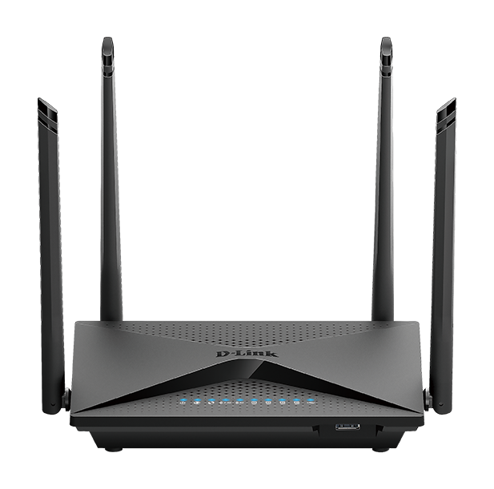

# The Router

The current setup uses _D-Link DIR-853 A3_ wireless router.

## The Specs

* Model: DIR-853
* H/W Ver: A3

* CPU: MIPS 1004Kc V2.15 880MHz (2 cores, 4 threads)
* RAM: 256 MB
* Disk: 24 MB

This device has resonably good compute and memory, but not enough disk space to install many external software. Using external USD disk will address that issue.

