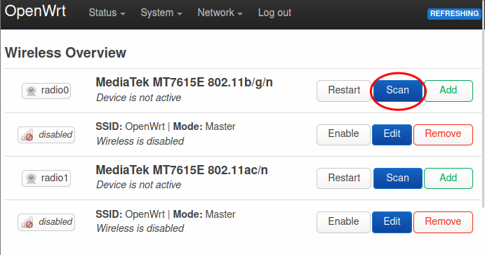
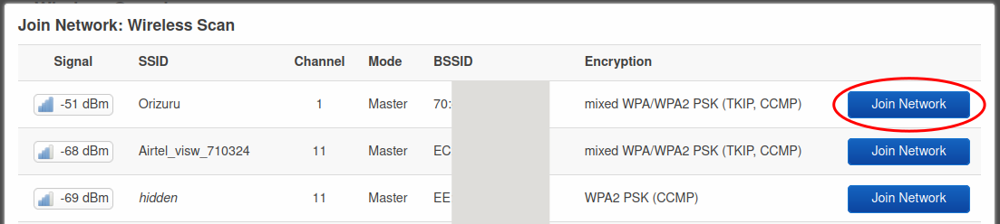
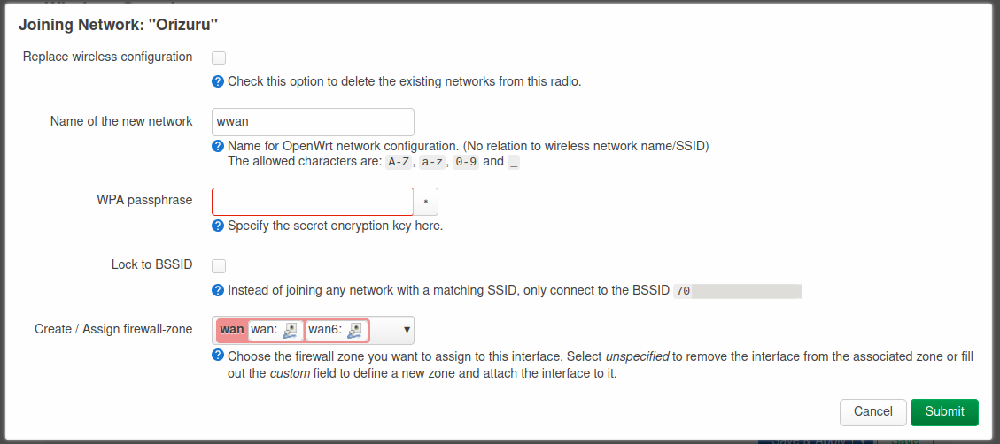
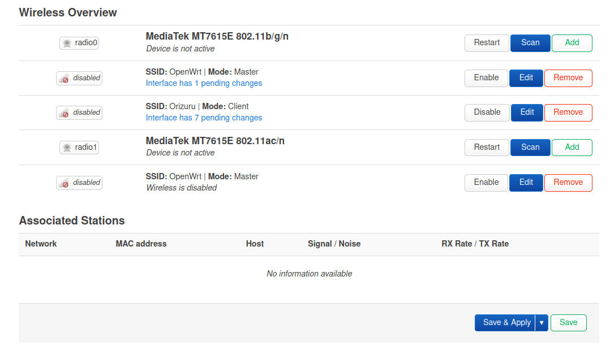
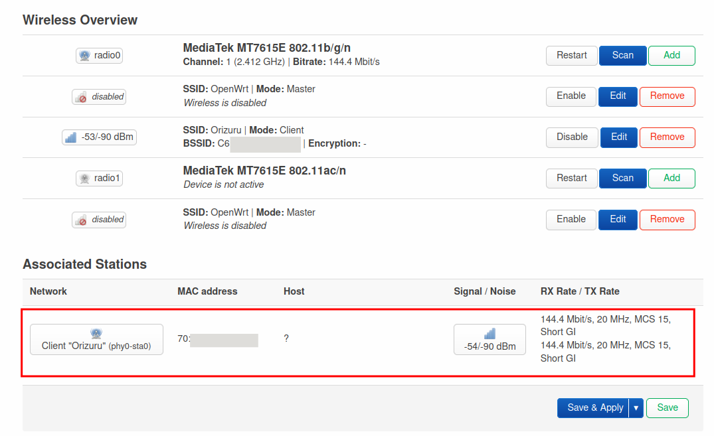

# Connecting to client Wi-Fi network

_Configure the router to connect to an existing wifi network to reach the internet._

## Step 1: Go to Wireless Overview page

Go to `Network > Wireless` page in the router
admin interface.

Click on the `Scan` button of `radio0`. The `radio0` is the `2.4 GHz` network and the `radio1` is the `5 GHz` network. Use `radio1` instead of `radio0` if you would like to connect to a `5 GHz`network.

## Step 2: Wireles Scan

You'll see the `Wireless Scan` dialog. Select the network that you want to join.

## Step 3: Join Network

You'll be prompted with the `Joining Network` dialog.

Please enter the wifi password in the `WPA passphase` field and _Submit_.

Click _Save_ on the next dialog.

## Step 4: Save & Apply

You'll be back to the _Wireless Overview_ page. Click on _Save and Apply_ at the bottom of the page.

The router will apply the changes and restart. And you'll see an entry in the _Associated Stations_ section.

## Step 5: Verify

You should be able to connect to internet from your laptop. Verify by opening any website from your browser or by running `ping google.com` from terminal.

The router is connected to internet and can be used with an ethernet connection, but the wifi access point is not enabled yet. We'll configure that in the next step.