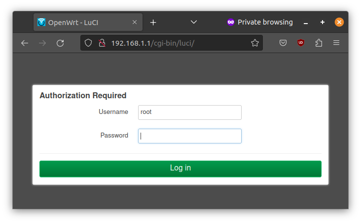
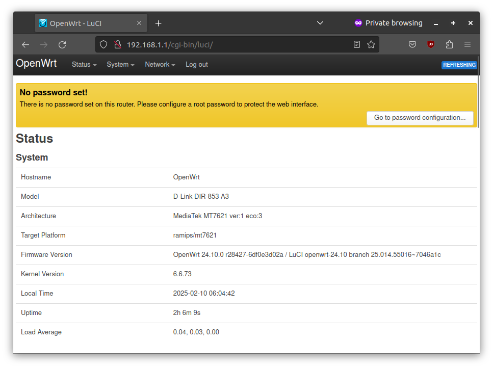

# Connecting to the Router

_Connect your laptop to the router using ethernet cable to configure it._

You can configure the router by connecting it to a laptop via ethernet. Connect the laptop ethernet port to one of the LAN ports (one of the yellow ports).

## Network Setup

After connecting, setup the laptop with manual IP address with the following settings.

```
IP Address: 192.168.1.2
Subnet mark: 255.255.255.0
Gateway: 192.168.1.1
```

## Ping Test

After the settings are done, you can verify if you can reach the router by running the `ping` command
from terminal/command promt.

```
$ ping 192.168.1.1
PING 192.168.1.1 (192.168.1.1) 56(84) bytes of data.
64 bytes from 192.168.1.1: icmp_seq=1 ttl=64 time=0.675 ms
64 bytes from 192.168.1.1: icmp_seq=2 ttl=64 time=0.680 ms
64 bytes from 192.168.1.1: icmp_seq=3 ttl=64 time=0.682 ms
^C
--- 192.168.1.1 ping statistics ---
3 packets transmitted, 3 received, 0% packet loss, time 2029ms
rtt min/avg/max/mdev = 0.675/0.679/0.682/0.003 ms
```

## The Router Admin Interface

Open your browser and visit <http://192.168.1.1/> or <http://openwrt.lan>.



It will ask you to login. Press _Log in_ without entering any password.

You'll be see the status page of the router.



Congratulations! You have sucessfully connected to the router. The next step is to secure the device.