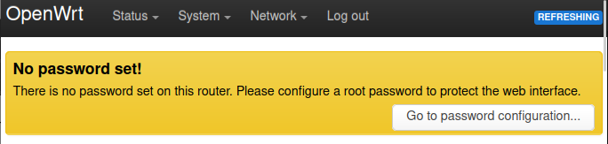
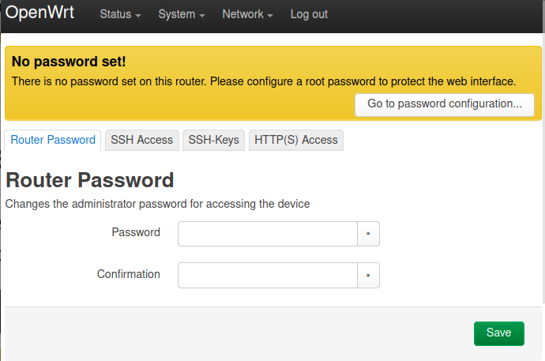

# Securing the Device

_Set a password to secure the router from unauthrized access._

When you go to the router web interface, it was a "No password set!" warning at the top of the page.

Click on _Go to password configuration_ and set a password.

## Connecting to an existing wifi network

Go to `Network > Wireless` page.

