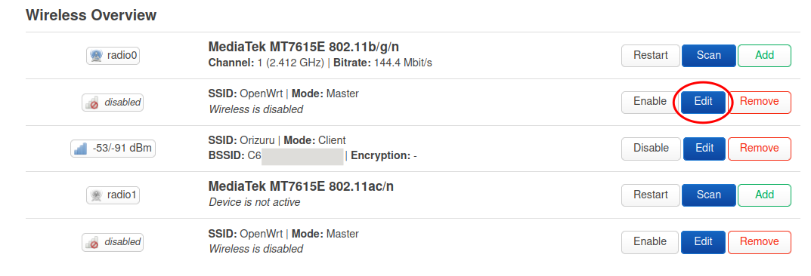
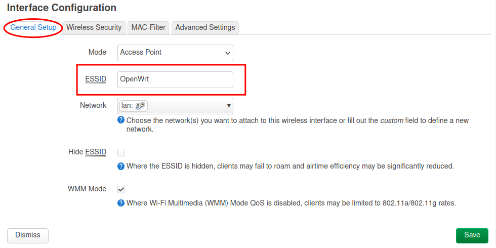
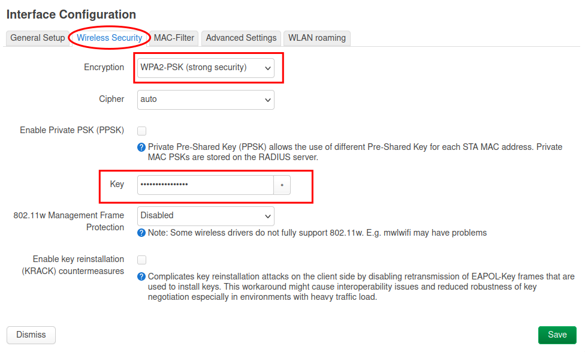
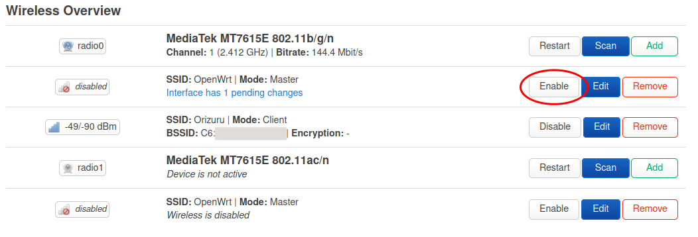

# Enable Wifi Access Point

_Enable wifi access points in the router so that devices in the visinity (laptops and mobile phones) can connect to the router._

The router has two accesspoints one each for 2.4 GHz and 5 GHz band. The 2.4 GHz band has lower bandwidth, but spans longer distances. The 5 GHz band on the other hand has high bandwidth, but covers only a short distance.

## Configure 2.4 GHz Access Point

Click on the _Edit_ button of the first access point (second row).

Set the access point name.

Go to the _Wireless Security_ tab, select `WPA2-PSK (strong security)` as Encryption and set a password in the `Key` field.

Click on the `Save` button.

Once you are back on the _wireless overview_ page, click on the _Enable_ button for the access point.

The 2.GHz access point is now live.

## Configure 5 GHz Access Point

Click on the _Edit_ button of the second access point (last row).

Repeat the same steps as in the previous step.

Don't forget to enable to access point at the end.

You can select the same name for both the access points if you want the connecting device to automatically select best of these network, or you can have separate names.

The possible names would be `Farmhill Wifi` and `Farmhill Wifi 5G` for 2.4 and 5 GHz respectively.

## Verifying

Now both the access points are live. You can verify by connecting to wifi from a laptop or a mobile phone.

